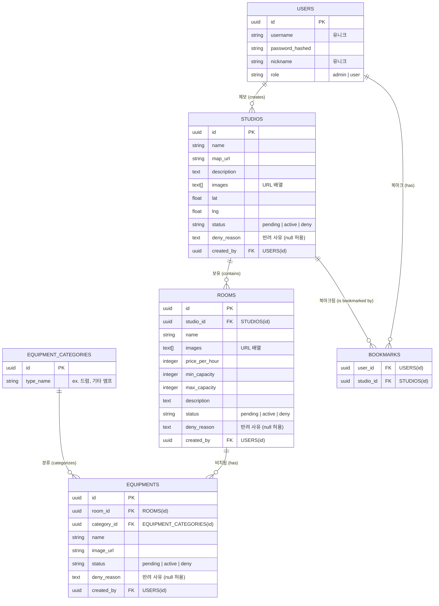

<!-- 합주실 지도 앱의 데이터베이스 ERD 설계 문서 -->
# 합주실 지도 서비스 ERD (Entity-Relationship Diagram)

본 문서는 `database-design` 스킬의 관계(Relations) 설계 원칙과 `mermaid-expert` 스킬의 구문을 바탕으로 작성된 데이터베이스 ERD입니다.

## 1. 개체 관계도 (ERD)

## 2. 주요 관계(Relationships) 설명

* **Users - Studios / Rooms / Equipments (1:N):** 유저 한 명이 여러 합주실, 방, 장비를 제보(created_by)할 수 있습니다.
* **Users - Bookmarks (1:N) / Studios - Bookmarks (1:N):** 유저와 합주실 간의 다대다(N:M) 관계를 해소하기 위한 교차 테이블입니다.
* **Studios - Rooms (1:N):** 하나의 합주실에는 여러 개의 방이 존재할 수 있습니다.
* **Rooms - Equipments (1:N):** 하나의 방에는 여러 개의 장비가 비치될 수 있습니다.
* **EquipmentCategories - Equipments (1:N):** 장비 카테고리 하나에 여러 장비가 속할 수 있어, 추후 어드민이 유연하게 장비 카테고리를 확장할 수 있습니다.
